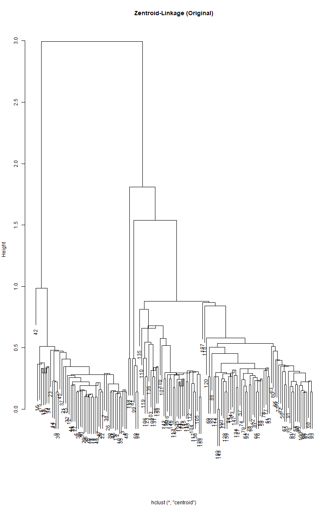
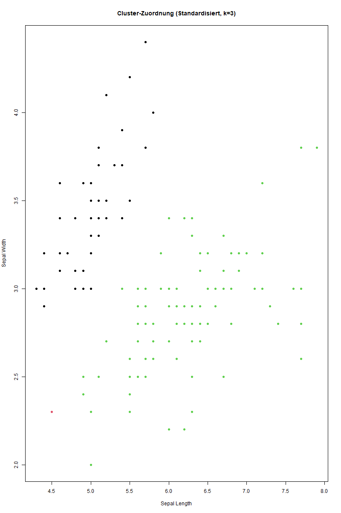

# Zentroid-Linkage

## Verfahren

Das Zentroid-Linkage ist ein hierarchisches, agglomeratives Clusterverfahren
bei dem der Abstand zwischen zwei Clustern als die Distanz zwischen deren
Schwerpunkten (Zentroiden) definiert wird.

### Funktionsweise:

1. Zu Beginn bildet jedes Objekt ein eigenes Cluster

2. Die Zentroide aller Cluster werden berechnet (Durchschnittswerte aller
   Merkmale der Objekte im Cluster)

3. Die zwei Cluster mit der geringsten Distanz zwischen ihren Zentroiden werden
   zu einem neuen Cluster verschmolzen

4. Der Zentroid des neuen Clusters wird als Durchschnitt aller enthaltenen
   Objekte neu berechnet

5. Die Schritte 3-4 werden wiederholt bis nur noch ein Cluster übrig ist

### Eigenschaften:

- Robust gegenüber Ausreißern
- Tendenz zu gleichmäßig großen Clustern
- Kann "Kettenbildung" wie beim Single-Linkage vermeiden
- Zentroide können zwischen den tatsächlichen Datenpunkten liegen
- Nicht invariant gegenüber monotonen Transformationen

Das Verfahren eignet sich besonders gut für kompakte, kugel- oder
ellipsenförmige Cluster und wenn die Cluster etwa gleich groß sein sollen.

## Aufgaben

### 1. Sichten Sie den Datensatz

#### Was bilden die Daten ab?

Der Iris-Datensatz enthält morphologische Messungen von drei verschiedenen
Iris-Arten (Schwertlilien).

#### Welche und wieviele Objekte wurden erfasst?

Es wurden insgesamt 150 Iris-Blumen erfasst, jeweils 50 von jeder der drei
Arten:

- Iris setosa
- Iris versicolor
- Iris virginica

#### Welche Variablen?

Es wurden 4 metrische Merkmale gemessen:

- Länge des Kelchblatts (Sepal Length)
- Breite des Kelchblatts (Sepal Width)
- Länge des Kronblatts (Petal Length)
- Breite des Kronblatts (Petal Width)

Sowie die kategorische Variable "Species" für die Iris-Art.

#### Skalenniveaus, Verteilung der Werte, Skalierung?

- Die 4 Messgrößen sind metrisch/intervallskaliert und in Zentimetern angegeben
- Die Species-Variable ist nominal-skaliert mit 3 Ausprägungen
- Die Werte sind nicht standardisiert/normiert

#### Fehlende Werte?

Der Datensatz enthält keine fehlenden Werte.

#### Anomalien?

Keine offensichtlichen Ausreißer oder Anomalien erkennbar. Die Messungen
erscheinen plausibel und konsistent.

### 2. Organisieren Sie den Datensatz in einer multivariaten Datenmatrix.

Der Iris-Datensatz wurde in R eingelesen und in ein Dataframe konvertiert. Die
Daten wurden in separate Dataframes für die drei Iris-Arten aufgeteilt.

### 3. Entscheiden Sie, welchem Zweck oder welchem Interesse das Clustern der Datenobjekte dienen soll/kann und wählen Sie die für die Analyse passenden Variablen aus.

Das Ziel der Clusteranalyse ist es, zu untersuchen ob die morphologischen
Merkmale ausreichen, um die drei Iris-Arten voneinander zu unterscheiden. Dafür
werden alle vier metrischen Merkmale verwendet:

- Sepal Length
- Sepal Width
- Petal Length
- Petal Width

### 4. Wählen Sie mindestens ein passendendes Clusterverfahren für die Analyse aus.

Als hierarchisches Clusterverfahren wird die Zentroid-Linkage-Methode verwendet.
Diese eignet sich gut für metrische Daten und ist robust gegenüber Ausreißern.

### 5. Wählen Sie aus, welche Objekte in die Analyse einzubeziehen sind.

_Sollte der Datensatz zu umfangreich sein, verwenden Sie eine Stichprobe. Die
Stichprobe sollte ausreichend groß sein, dass aufgrund der gefundenen
Gruppierung Rückschlüsse auf die Grundgesamtheit möglich sind._

Es werden alle 150 Iris-Blumen in die Analyse einbezogen, da der Datensatz nicht
zu umfangreich ist.

### 6. Standardisieren Sie die Daten falls notwendig.

Da die Merkmale in unterschiedlichen Größenordnungen vorliegen, werden die Daten
standardisiert. Dies erfolgt mit der scale()-Funktion in R.

### 7. Wählen Sie ein zu den Daten passendes Distanzmaß. Berechnen Sie eine entsprechende Datenmatrix.

Als Distanzmaß wird die euklidische Distanz verwendet, da diese für metrische
Daten geeignet ist. Die Distanzmatrix wird mit der dist()-Funktion berechnet.

### 8. Führen Sie das/die ausgewählten Verfahren für die Clusteranalyse durch.

Die Zentroid-Linkage-Clusteranalyse wird sowohl mit den ursprünglichen als auch
mit den standardisierten Daten durchgeführt. Die Ergebnisse werden für 2-5
Cluster berechnet.

### 9. Visualisieren und analysieren Sie die Ergebnisse:

#### Zeigen die Daten eine Struktur?




Die Dendrogramme zeigen eine hierarchische Struktur, allerdings ist diese nicht
sehr ausgeprägt. Sowohl bei den originalen als auch bei den standardisierten
Daten ist zu erkennen, dass die Cluster-Bildung nicht optimal verläuft.

#### Was ist die optimale Anzahl Cluster?

Die Dendrogramme legen nahe, dass das Zentroid-Linkage-Verfahren hauptsächlich
zwei dominante Cluster bildet. Ein dritter Cluster wird zwar gebildet, enthält
aber nur wenige Objekte. Dies entspricht nicht der erwarteten Struktur von drei
etwa gleich großen Gruppen.

#### Zuordnung der Objekte zu Clustern.

##### Originaldaten

```
            1  2  3
Setosa     50  0  0
Versicolor  0 50  0
Virginica   0 48  2
```


##### Standardisierte Daten

```
            1  2  3
Setosa     49  1  0
Versicolor  0  0 50
Virginica   0  0 50
```



##### Fazit

Die Objekte wurden mit der cutree()-Funktion den Clustern zugeordnet. Die
Analyse der 3-Cluster-Lösung zeigt, dass sowohl bei originalen als auch
standardisierten Daten zwei große Cluster entstehen, während der dritte Cluster
nur wenige Blumen enthält.

### 10. Interpretieren Sie die Ergebnisse inhaltlich bezüglich der im Schritt 3 formulierten Ausgangsidee.

Die Clusteranalyse mit dem Zentroid-Linkage-Verfahren zeigt, dass diese Methode
für den vorliegenden Datensatz nicht optimal geeignet ist. Obwohl das Ziel war,
die drei Iris-Arten anhand ihrer morphologischen Merkmale zu unterscheiden,
bildet das Verfahren hauptsächlich zwei Cluster. Die tatsächliche Struktur der
drei Iris-Arten wird nicht adäquat abgebildet. Dies gilt sowohl für die
originalen als auch für die standardisierten Daten. Für eine bessere Trennung
der Iris-Arten sollten alternative Clustering-Verfahren in Betracht gezogen
werden.

Die Hauptprobleme des Zentroid-Linkage bei diesem Datensatz sind:

- Die Tendenz, ungleichmäßig große Cluster zu bilden
- Schwierigkeiten bei der Erkennung der natürlichen Dreier-Struktur
- Weniger deutliche Cluster-Grenzen im Vergleich zu anderen hierarchischen
  Verfahren
